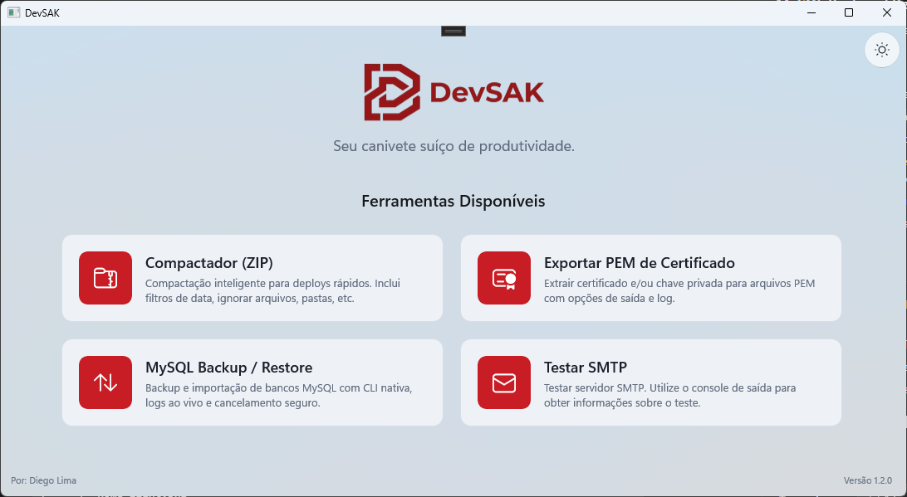
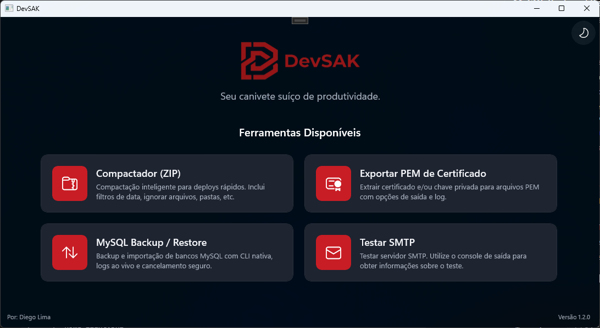
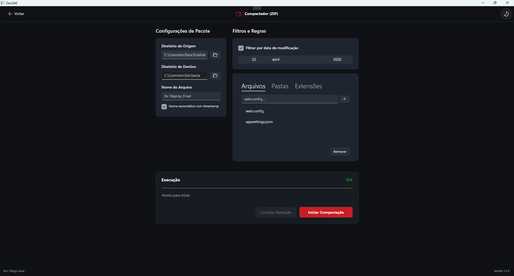
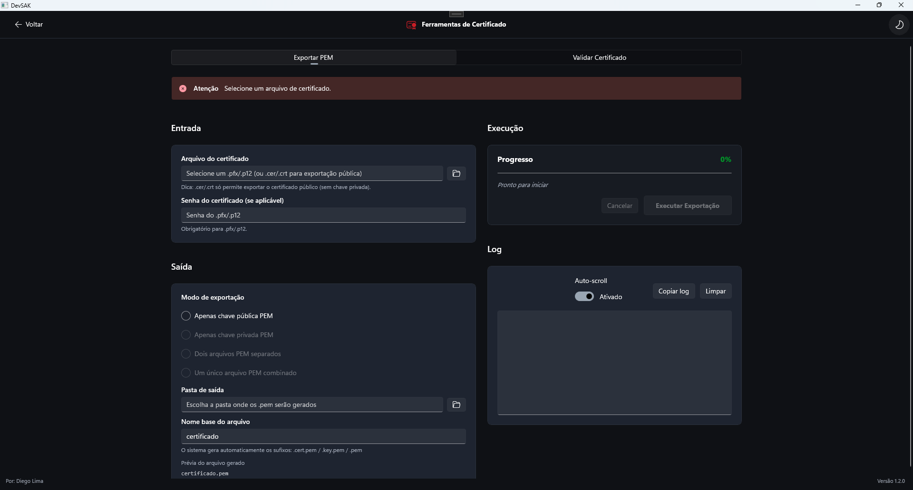
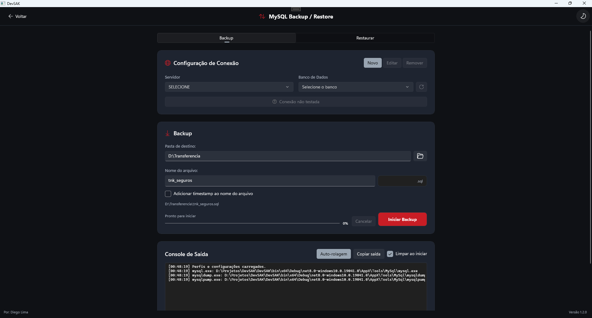
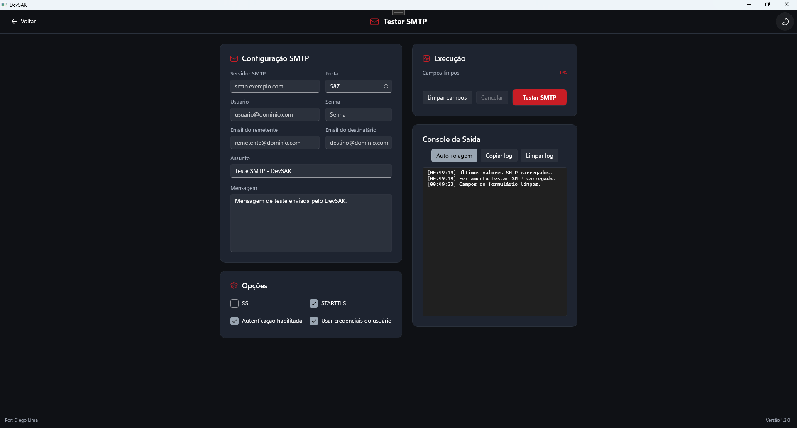

# DevSAK


**DevSAK** é uma suíte desktop premium para Windows que reúne utilitários práticos para o dia a dia de desenvolvimento, implantação, certificados, banco de dados e diagnóstico de e-mail.

Construído em **C#**, **.NET 8** e **WinUI 3**, o aplicativo entrega uma experiência moderna com visual nativo, suporte a tema claro/escuro, interface com Mica e ferramentas focadas em produtividade real.

---

## Visão geral

DevSAK significa **Developer Swiss Army Knife**: um canivete suíço para tarefas recorrentes que normalmente exigem scripts soltos, comandos manuais ou ferramentas separadas.

O projeto está organizado como uma aplicação Windows desktop com navegação por cards, páginas dedicadas para cada ferramenta e serviços internos responsáveis por execução, persistência de configurações e integração com CLIs auxiliares.

Versão atual declarada no projeto: **1.2.0**.

## Ferramentas disponíveis

### Compactador ZIP

Cria pacotes `.zip` a partir de um diretório de origem, com foco em cenários de deploy.

- Seleção de diretório de origem e destino.
- Nome de arquivo manual ou automático com timestamp.
- Filtro por data de modificação.
- Listas para ignorar arquivos, pastas e extensões.
- Progresso por etapa, arquivo atual e cancelamento da operação.

### Certificados

Área dedicada para trabalhar com certificados digitais.

- Exportação de certificados para PEM.
- Suporte a `.pfx`, `.p12`, `.cer` e `.crt`.
- Exportação de certificado público, chave privada, arquivos separados ou PEM combinado.
- Validação de certificado com detalhes como Subject, Issuer, validade, expiração, thumbprint, serial number, algoritmo, tamanho da chave e SAN/DNS names.
- Log de execução, cópia de resumo e cópia de thumbprint.

### MySQL Backup / Restore

Interface para backup e restauração de bancos MySQL usando ferramentas CLI embarcadas.

- Cadastro, edição e remoção de perfis de conexão.
- Teste de conexão e listagem de bancos.
- Backup com `mysqldump.exe` e fallback opcional para `mysqlpump.exe`.
- Restauração de arquivos `.sql`.
- Restauração a partir de arquivos compactados, com extração via suporte nativo a `.zip` ou 7-Zip embarcado para outros formatos.
- Opções para desabilitar `FOREIGN_KEY_CHECKS` e recriar a base antes da restauração.
- Console de saída com auto-rolagem, cópia de log, progresso e cancelamento seguro.

### Teste SMTP

Ferramenta para validar envio de e-mail por servidores SMTP.

- Configuração de servidor, porta, usuário, senha, remetente, destinatário, assunto e mensagem.
- Opções de SSL, STARTTLS, autenticação e uso de credenciais.
- Envio de mensagem de teste via MailKit.
- Console de saída com status da conexão, validação TLS, autenticação e envio.

## Experiência visual

O aplicativo usa uma tela inicial com cards de ferramentas, ícones Fluent, janela maximizada por padrão e alternância manual entre temas.

| Tema claro | Tema escuro |
| --- | --- |
|  |  |

### Ferramentas em destaque

| Compactador ZIP | Certificados |
| --- | --- |
|  |  |

| MySQL Backup / Restore | Teste SMTP |
| --- | --- |
|  |  |

## Tecnologias

- **C# / .NET 8** com `net8.0-windows10.0.19041.0`.
- **WinUI 3** com Windows App SDK.
- **MSIX tooling** para empacotamento.
- **CommunityToolkit.WinUI.Controls.Segmented** para controles segmentados.
- **MailKit / MimeKit** para envio e validação SMTP.
- **MySqlConnector** para operações auxiliares com MySQL.
- **System.Security.Cryptography.ProtectedData** para proteger senhas no usuário atual do Windows.
- **System.IO.Compression** para geração de ZIP e extração nativa de `.zip`.
- Assets próprios para ícone, splash screen, logos e temas.

## Estrutura do projeto

```text
DevSAK/
├─ Assets/                 # Ícones, logos, splash screen e imagens do pacote
├─ Converters/             # Conversores usados pelo XAML
├─ Models/                 # Modelos das ferramentas e estados de operação
├─ Services/               # Regras de negócio, persistência e integração com CLIs
├─ Themes/                 # Recursos de tema claro/escuro e cores da aplicação
├─ Tools/
│  ├─ 7Zip/                # 7z.exe, 7z.dll e licença do 7-Zip
│  └─ MySql/               # Executáveis e DLLs do cliente MySQL
├─ ViewModels/             # ViewModels das páginas
├─ Views/                  # Telas WinUI das ferramentas
├─ App.xaml                # Recursos globais da aplicação
├─ MainWindow.xaml         # Dashboard, navegação e alternância de tema
├─ Package.appxmanifest    # Manifesto MSIX
└─ DevSAK.csproj           # Configuração do projeto .NET/WinUI
```

Na raiz do repositório:

```text
DevSAK.slnx                # Solução do Visual Studio
README.md                 # Documentação do projeto
Logos_Originais/          # Arquivos originais de logo e ícone
```

## Como executar localmente

### Pré-requisitos

- Windows 10/11.
- Visual Studio 2022 com workload de desenvolvimento desktop .NET e suporte a Windows App SDK/WinUI.
- .NET SDK compatível com .NET 8.

### Pelo Visual Studio

1. Abra `DevSAK.slnx`.
2. Selecione a plataforma desejada, normalmente `x64`.
3. Escolha um dos perfis:
   - **DevSAK (Package)** para execução como pacote MSIX.
   - **DevSAK (Unpackaged)** para execução direta do projeto.
4. Compile e execute.

### Pela linha de comando

```powershell
dotnet build .\DevSAK.slnx -p:Platform=x64
```

Para executar o projeto diretamente:

```powershell
dotnet run --project .\DevSAK\DevSAK.csproj -p:Platform=x64
```

## Build e publicação

O projeto está preparado para Windows desktop com:

- `OutputType` como `WinExe`.
- `UseWinUI` habilitado.
- `EnableMsixTooling` habilitado.
- Plataformas `x86`, `x64` e `ARM64`.
- Runtime identifiers `win-x86`, `win-x64` e `win-arm64`.
- `PublishReadyToRun` habilitado fora de Debug.
- `PublishTrimmed` desabilitado.

Para gerar builds de publicação, use o fluxo de **Publish** do Visual Studio para WinUI/MSIX ou publique pela CLI informando a plataforma/runtime desejados.

Exemplo:

```powershell
dotnet publish .\DevSAK\DevSAK.csproj -c Release -p:Platform=x64 -r win-x64
```

## Ferramentas e arquivos embarcados

O DevSAK inclui ferramentas auxiliares dentro de `DevSAK/Tools`.

### MySQL

A pasta `Tools/MySql` contém executáveis e DLLs do cliente MySQL usados pela ferramenta de backup e restauração, incluindo:

- `mysql.exe`
- `mysqldump.exe`
- `mysqlpump.exe`
- bibliotecas necessárias para execução dos utilitários

Durante o build, esses arquivos são copiados para o diretório de saída em `Tools/MySql`.

### 7-Zip

A pasta `Tools/7Zip` contém:

- `7z.exe`
- `7z.dll`
- `License.txt`

O 7-Zip é usado como apoio na extração de arquivos compactados durante restaurações MySQL quando o arquivo selecionado não é um `.zip` suportado nativamente.

## Configurações locais

Algumas preferências são salvas em `%AppData%\DevSAK`.

- `AppZipSettings.json`: configurações do compactador ZIP.
- `SmtpTestSettings.json`: configurações da ferramenta SMTP.
- `MySqlConnections.json`: perfis de conexão MySQL.

Senhas armazenadas pelas ferramentas são protegidas com DPAPI via `ProtectedData`, usando o escopo do usuário atual do Windows.

## Roadmap

Ideias naturais para evolução do projeto:

- Adicionar capturas reais da interface na documentação.
- Criar instalador ou pipeline automatizado de publicação.
- Ampliar a suíte com novos utilitários de desenvolvimento.
- Adicionar testes automatizados para serviços críticos.
- Documentar origem e versão dos binários embarcados em `Tools`.

## Licença

Nenhuma licença principal do projeto foi identificada no repositório.

Há uma licença específica do 7-Zip em `DevSAK/Tools/7Zip/License.txt`. Caso o projeto seja distribuído publicamente, recomenda-se adicionar uma licença explícita para o DevSAK e revisar as obrigações das ferramentas embarcadas.
