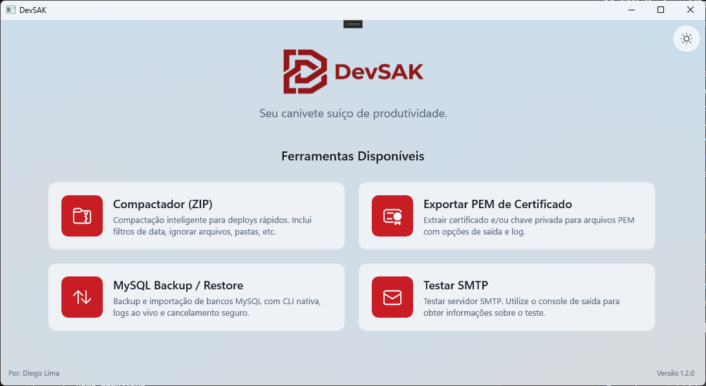
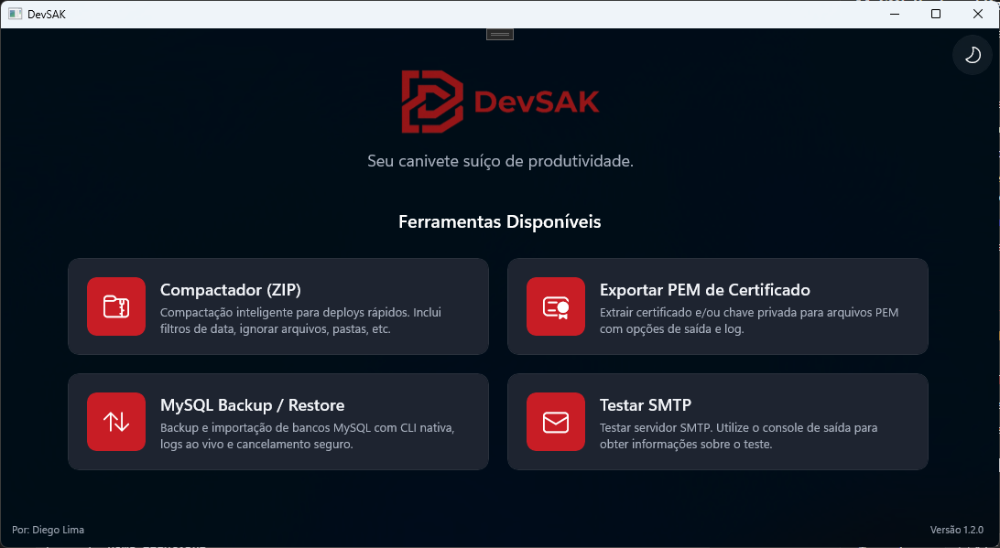
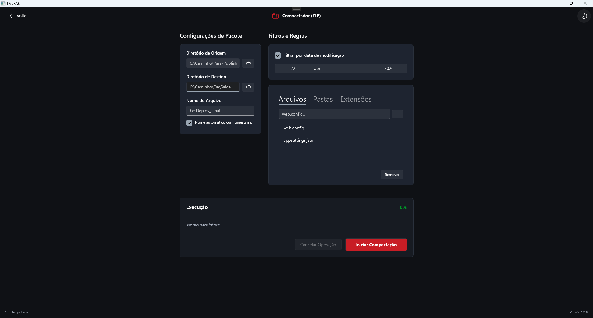
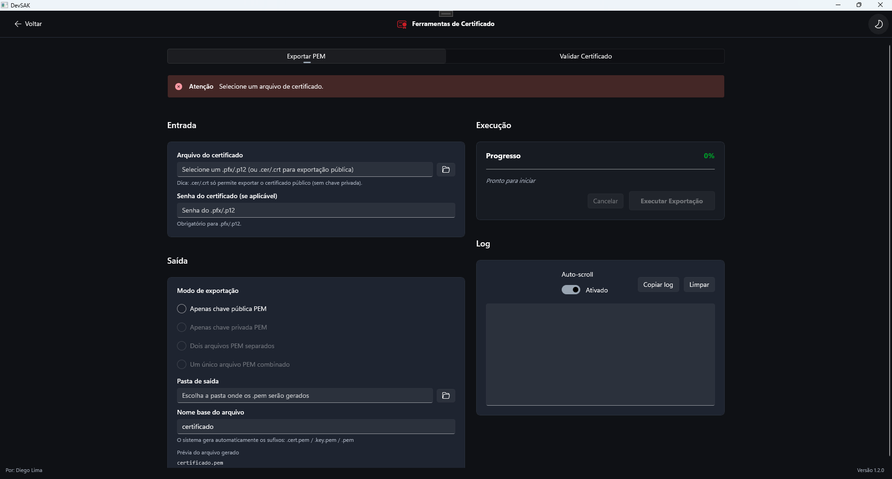
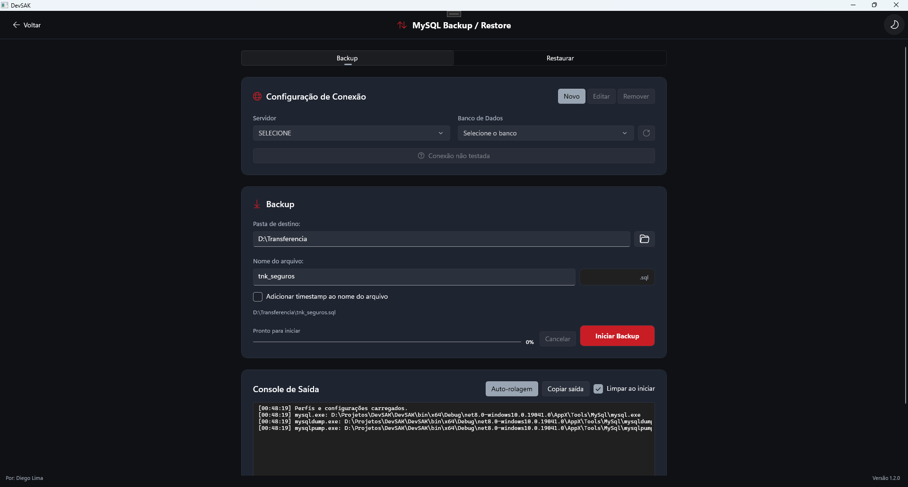
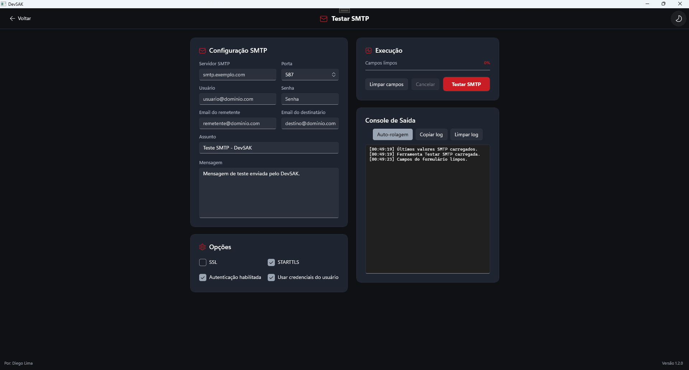

# DevSAK


**DevSAK** (*Developer Swiss Army Knife*) é uma suíte desktop para Windows com utilitários do dia a dia de desenvolvimento: compactação ZIP, certificados, backup/restauração MySQL e teste SMTP.

Construído em **C#**, **.NET 8** e **WinUI 3**, com tema claro/escuro, interface em Mica e ferramentas CLI embarcadas. Versão atual do projeto: **1.3.4**.

---

## Ferramentas

| Ferramenta | O que faz |
| --- | --- |
| **Compactador (ZIP)** | Gera `.zip` a partir de um diretório, com nome manual ou timestamp, filtro por data, perfis de regras de exclusão com importação/exportação JSON, upload para StorageTo/File.Kiwi/FTP e progresso com cancelamento. |
| **Ferramentas de certificado** | Exporta PEM (`.pfx`, `.p12`, `.cer`, `.crt`) e valida certificados (Subject, Issuer, validade, thumbprint, SAN/DNS, etc.). |
| **MySQL Backup / Restore** | Perfis de conexão, backup configurável com `mysqldump`, restore de `.sql`/arquivos compactados, opção de compactar o backup em ZIP e criação de banco quando aplicável. |
| **Testar SMTP** | Envia mensagem de teste via MailKit (SSL/STARTTLS, autenticação) e exibe o resultado no console. |

---

## Interface

Dashboard com cards, ícones Fluent e alternância de tema. O tema escolhido é gravado em `%AppData%\DevSAK` e restaurado na próxima execução.

Os cards das ferramentas seguem o mesmo padrão: ícone na cor de destaque e
título dentro do card, cantos de 12 px e espaçamento interno de 24 px. Cards de
console ou log mantêm apenas o título. O padrão também cobre Compactador ZIP,
Exportar PEM e Validar Certificado. Todas as barras de progresso têm espessura
de 8 px, definida globalmente, inclusive a barra do atualizador. No compactador,
Filtro por data, Configurações do pacote e Execução ficam alinhados pelo topo.

Veja as convenções em [docs/INTERFACE.md](docs/INTERFACE.md). As capturas abaixo
são ilustrativas e podem representar versões anteriores da interface.

| Tema claro | Tema escuro |
| --- | --- |
|  |  |

| Compactador ZIP | Certificados |
| --- | --- |
|  |  |

| MySQL Backup / Restore | Teste SMTP |
| --- | --- |
|  |  |

Após atualizar para uma versão nova, o DevSAK pode exibir as **notas de versão** uma vez (conteúdo em `Resources/ReleaseNotes`). A última versão exibida fica salva localmente.

---

## Tecnologias

Stack efetivamente usada no projeto:

- **C# / .NET 8** (`net8.0-windows10.0.19041.0`), Windows 10 1809 ou posterior
- **WinUI 3** e **Windows App SDK** (`Microsoft.WindowsAppSDK`)
- **XAML** (páginas, temas e janela principal)
- **CommunityToolkit.WinUI.Controls.Segmented**
- **MailKit / MimeKit** (SMTP) e **BouncyCastle** (exportação PEM)
- **FluentFTP** (upload FTP/FTPS e navegação remota)
- **MySqlConnector** (operações auxiliares MySQL)
- **System.IO.Compression** (ZIP nativo)
- **System.Text.Json** e **System.Security.Cryptography.ProtectedData** (configurações e senhas no escopo do usuário Windows)
- **Process** para executar `mysqldump` / `mysql` / `7z` embarcados

---

## Estrutura

```text
DevSAK.slnx
README.md
docs/                      # Logos e screenshots da documentação
Installer/                 # Script e arquivos de apoio do Inno Setup
DevSAK/
├─ Assets/                 # Ícone, logos e imagens do app
├─ Converters/
├─ Models/
├─ Resources/ReleaseNotes/ # Notas de versão empacotadas com o app
├─ Services/
├─ Themes/
├─ Tools/
│  ├─ 7Zip/                # 7z.exe, 7z.dll, License.txt
│  └─ MySql/               # Cliente MySQL (mysql, mysqldump, mysqlpump, …)
├─ ViewModels/
├─ Views/
├─ Properties/PublishProfiles/   # Perfil de publicação win-x64
├─ App.xaml
├─ MainWindow.xaml
└─ DevSAK.csproj
```

`Tools` faz parte do runtime: os binários são copiados para a saída do build e entram no `publish` de produção.

---

## Desenvolvimento (Visual Studio)

Pré-requisitos:

- Windows 10 ou 11 (x64 recomendado)
- Visual Studio 2022 com suporte a desenvolvimento Windows / WinUI 3 / Windows App SDK
- SDK do .NET 8

1. Clone o repositório.
2. Abra `DevSAK.slnx`.
3. Restaure os pacotes NuGet (o Visual Studio faz isso ao abrir a solução).
4. Selecione a plataforma **x64** e a configuração **Debug**.
5. Use o perfil **DevSAK (Unpackaged)** para executar o projeto diretamente (há também **DevSAK (Package)** para o fluxo MSIX de desenvolvimento).
6. Compile e inicie a depuração.

Pela linha de comando:

```powershell
dotnet build .\DevSAK.slnx -p:Platform=x64
dotnet run --project .\DevSAK\DevSAK.csproj -p:Platform=x64
```

---

## Produção (self-contained)

A distribuição de produção é **self-contained** e **unpackaged**:

- Configuração: **Release**
- Arquitetura: **x64**
- Runtime: **win-x64**
- `SelfContained=true`
- `WindowsAppSDKSelfContained=true`

O payload final fica em:

```text
DevSAK/bin/x64/Release/net8.0-windows10.0.19041.0/win-x64/publish/
```

Essa pasta `publish` é o que o instalador empacota. O diretório `publish` em si **não** deve aparecer como subpasta na instalação (`…\DevSAK\DevSAK.exe`, não `…\DevSAK\publish\…`).

Self-contained, neste projeto, significa que o `publish` inclui o runtime do **.NET 8** e os arquivos do **Windows App SDK**. O computador de destino **não precisa do SDK do .NET**. O instalador ainda pode instalar o **WebView2 Runtime** (dependência do Windows App SDK) se ele ainda não estiver no Windows.

### Publicar pelo Visual Studio

1. Abra `DevSAK.slnx`.
2. Selecione **Release** e **x64**.
3. Clique com o botão direito no projeto **DevSAK** → **Publish**.
4. Use o perfil **win-x64** (`Properties/PublishProfiles/win-x64.pubxml`).
5. Publique. Confira a pasta `publish` indicada acima.

### Publicar pela linha de comando

Use o perfil do projeto (ele aplica self-contained, Windows App SDK embarcado e a limpeza de pastas de idioma extras):

```powershell
dotnet publish .\DevSAK\DevSAK.csproj -c Release -p:Platform=x64 -p:PublishProfile=win-x64
```

---

## Instalador

O diretório `Installer/` contém o script Inno Setup e os arquivos de apoio (`LICENSE.txt`, `INFO_BEFORE.txt`, `INFO_AFTER.txt`, ícone, bootstrapper do WebView2).

- O setup instala o **conteúdo** de `publish` para o usuário atual (`%LocalAppData%\Programs\DevSAK`).
- A saída gerada (`Installer/output/`, por exemplo `DevSAK_Installer_v1.3.4.exe`) não deve ser commitada (está no `.gitignore`).
- Detalhes para quem mantém o instalador: `Installer/README.md`.

---

## Atualizações automáticas

A partir da versão 1.3.3, o aplicativo consulta as Releases públicas do GitHub ao
abrir e a cada quatro horas enquanto estiver aberto. O botão **Verificar
atualizações** permite consultar manualmente. O aviso mostra versão, tamanho e
notas da Release; o usuário autoriza o download, acompanha o progresso e pode
cancelá-lo. Depois, **Instalar e reiniciar** aplica a atualização quando todas as
ferramentas estiverem ociosas, preservando as configurações em AppData.

O **próprio DevSAK baixa o instalador**, sem abrir o navegador ou redirecionar
o usuário para a página de download. A sequência é **Ver atualização → Baixar
atualização → Instalar e reiniciar**. O download fica em
`%LocalAppData%\DevSAK\Updates\<id>`; após a verificação de tamanho e SHA-256,
o instalador aplica a versão e reabre o aplicativo.

Para testar a atualização para **1.3.4**, use uma cópia **1.3.3** instalada pelo
instalador oficial x64 no usuário atual. Publique a release estável `v1.3.4`
com `DevSAK_Installer_v1.3.4.exe`, então clique em **Verificar atualizações**
nessa cópia antiga. Tags, commits ou releases em rascunho não bastam. Uma
cópia já na 1.3.4 não oferece atualização para a mesma versão.

O atualizador aceita apenas Releases estáveis com um instalador oficial x64 e
SHA-256 válido, conferido após o download e novamente antes da execução. A
instalação automática funciona na cópia instalada por usuário com Inno Setup;
builds de desenvolvimento, versões portáteis, x86, ARM64 e MSIX precisam de
atualização manual. Falhas nas consultas automáticas não interrompem o uso.

Para publicar uma versão, siga [docs/RELEASING.md](docs/RELEASING.md).

## Configurações locais

Gravadas em `%AppData%\DevSAK` (fora da pasta de instalação):

| Arquivo | Uso |
| --- | --- |
| `appsettings.json` | Tema e última versão das notas de release |
| `AppZipSettings.json` | Compactador ZIP, destino selecionado e exclusão após upload |
| `ftp-destinations.json` | Cadastro global de destinos FTP/FTPS com senhas protegidas |
| `storageto.key` | Chave de API do StorageTo protegida por DPAPI |
| `storageto.visitor` | Identificador persistente para uploads anônimos |
| `SmtpTestSettings.json` | Teste SMTP |
| `MySqlConnections.json` | Perfis MySQL |
| `MySqlBackupRestoreSettings.json` | Preferências de backup/restore |

Senhas das ferramentas usam DPAPI (`ProtectedData`) no escopo do usuário Windows.

### Perfis do Compactador ZIP

Selecione um perfil para aplicar suas regras de arquivos, pastas e extensões. Use **+** para criar um perfil e o menu **⋯** ao lado do seletor para renomear ou excluir o perfil selecionado; as alterações nas regras são salvas automaticamente. O último perfil selecionado é restaurado ao reabrir a ferramenta. Deve existir pelo menos um perfil.

Em telas largas, configurações do pacote, regras e execução ficam lado a lado. Ao reduzir a janela, a execução passa para um rodapé fixo e os editores se reorganizam. As listas de regras aproveitam a altura disponível e as abas mostram a quantidade de itens. A execução apresenta um resumo do perfil, nome do ZIP e destino; no modo automático, o timestamp é definido ao iniciar.

Os perfis ficam em uma coleção no arquivo local `AppZipSettings.json`. Na atualização, as regras anteriores são migradas automaticamente para um perfil **GERAL**, preservando as demais configurações do compactador.

Para compartilhar ou editar externamente, **Exportar JSON** gera um arquivo com apenas o perfil selecionado, sem caminhos locais ou histórico. **Importar JSON** aceita um perfil por arquivo e solicita confirmação antes de substituir outro com o mesmo nome (sem diferenciar maiúsculas de minúsculas).

Exemplo de arquivo que pode ser criado manualmente e importado:

```json
{
  "Version": 1,
  "Name": "NODE + REACT",
  "IgnoredFiles": [".env", ".env.local"],
  "IgnoredFolders": ["node_modules", ".git"],
  "IgnoredExtensions": [".map", ".log"]
}
```

Cada lista aceita uma regra por item, com os mesmos padrões de exclusão já utilizados pela ferramenta. Informe as extensões com ponto (por exemplo, `.log`); a importação também aceita `log` e acrescenta o ponto automaticamente. Novos perfis começam com as três listas vazias.

Validação automatizada da migração, perfis, JSON e geração de ZIPs: `dotnet run --project tests/DevSAK.AppZipTests/DevSAK.AppZipTests.csproj`.

### Upload do ZIP

No card **Opções de Upload**, selecione **Não fazer upload**, **StorageTo**, **File.Kiwi** ou **FTP**. Ao escolher um serviço, o arquivo é enviado assim que a compactação termina. A barra reinicia e mostra o progresso do envio; após a confirmação, **Copiar Link** copia o endereço compartilhável. O ZIP permanece no diretório de destino em falhas ou cancelamentos. A opção **Excluir o ZIP local após o upload bem-sucedido** remove o arquivo somente após a confirmação do destino. A escolha é salva; a opção antiga de upload habilitado migra para StorageTo.

O botão **Configurações** (engrenagem entre atualização e tema) permite salvar a chave de API do StorageTo, protegida para o usuário atual do Windows. A chave é validada antes de enviar; uma chave inválida precisa ser corrigida ou removida. Sem chave, o upload é anônimo. O envio usa a [API oficial](https://storage.to/pt/docs/api), com suporte a arquivos em partes.

Testes do protocolo com respostas simuladas: `dotnet run --project tests/DevSAK.StorageToTests/DevSAK.StorageToTests.csproj`.

O **File.Kiwi** usa a [API v2](https://file.kiwi/api), sem chave de API. O nome e o conteúdo do ZIP são criptografados localmente no formato RFC 8188 (AES-128-GCM), em partes enviadas sequencialmente. O link copiado inclui a chave de descriptografia no fragmento após `#`; compartilhe o link completo para permitir o download. O serviço só é considerado concluído após confirmar o recebimento de todas as partes.

Testes com respostas simuladas e vetor oficial de criptografia: `dotnet run --project tests/DevSAK.FileKiwiTests/DevSAK.FileKiwiTests.csproj`.

O **FTP** permite cadastrar vários destinos globais, reutilizáveis por outras ferramentas: descrição (ou host quando vazia), host, porta, usuário, senha, FTP/FTPS explícito/implícito, modo passivo e pasta remota. Use **+** para adicionar e **⋯** para editar ou excluir. O cadastro oferece navegação de pastas após uma conexão válida, valida os campos antes de conectar e mostra erros técnicos do servidor. O modo passivo tem tooltip explicativo, e a senha pode ser mostrada ou ocultada com um clique. Arquivos remotos existentes exigem confirmação antes da substituição.

Em falhas de upload, **Tentar Novamente** reenvia o ZIP existente. **Selecionar Outro Destino** mostra apenas upload e execução, com o botão **Enviar Arquivo**; **Cancelar operação** preserva o ZIP e restaura a tela completa. Se a remoção local falhar após o sucesso remoto, o diálogo informa o problema sem repetir o envio.

Com a exclusão após upload marcada, o modal de sucesso omite **Abrir Pasta**. Para StorageTo/File.Kiwi, mantém **Copiar Link** e **Fechar**; para FTP, sem link compartilhável, mantém **Fechar**.

Confira os detalhes e os comandos de teste em [docs/ZIP_UPLOAD.md](docs/ZIP_UPLOAD.md).

---

## Componentes de terceiros

O DevSAK distribui utilitários de terceiros em `DevSAK/Tools`. Eles permanecem sob as respectivas licenças:

- **MySQL** — cliente CLI em `Tools/MySql`
- **7-Zip** — `Tools/7Zip` (`License.txt` incluso); usado na extração de compactados que não são `.zip` nativo

A licença do DevSAK está em `Installer/LICENSE.txt`. Bibliotecas NuGet (MailKit, BouncyCastle, Windows App SDK, etc.) seguem os termos de cada pacote.

---

## Licença

Uso restrito conforme `Installer/LICENSE.txt`. Componentes de terceiros não são relicenciados pelo DevSAK.
